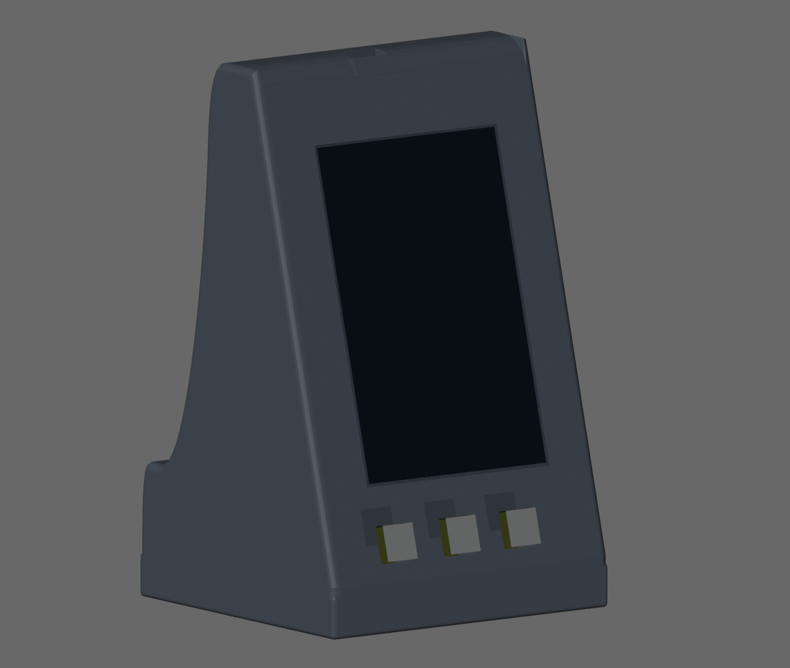

# IoT Enclosure V1 — cierre del prototipo CAD

Fecha: 14 de septiembre de 2026. Unidades: mm.

**Estado: diseño CAD del prototipo completado y exportado. Validación física pendiente.** Los STL y 3MF son archivos de prototipo para pruebas FDM; no constituyen una liberación de producción ni un perfil de máquina probado.

## Archivos de entrega

- `IoT_Enclosure_V1_FINAL.blend`: ensamblaje final, dos cuerpos principales, hardware original, referencias archivadas, fuentes y auditorías integradas como textos.
- El archivo principal `C:\LandingPage-TeLoInvento\blender\IoT_Enclosure_V1\IoT_Enclosure_V1_CP01.blend` también está actualizado.
- `CP00_original.blend`: copia del archivo original anterior a esta ejecución.
- `STL/FRONT_BODY.stl` y `STL/REAR_BODY.stl`: piezas independientes, coordenadas en mm, orientadas y apoyadas en Z=0.
- Los dos `.3mf` correspondientes contienen geometría con unidades explícitas, sin ajustes de impresora ni G-code.
- `PROBETAS/`: siete STL de prueba para abertura de botón, pilotos, guía y cierre inferior real.
- `parameters.json`, `mechanical_validation.json`, `fdm_validation.json` y `export_manifest.json`: decisiones, mediciones digitales, resultados y huellas de archivos.
- `FUENTES/`: las ocho fuentes de autoridad y el README suministrados.

## Cambios realizados

Se conservaron los seis objetos congelados: PCB, pantalla, tres botones y USB superior. Se compararon huellas SHA-256 de coordenadas de vértices, caras y transformaciones antes y después; coinciden. La inclinación PCB permanece aproximadamente en −15° alrededor de X. Las referencias no son piezas imprimibles; pantalla y botones originales son superficies de referencia, no modelos sólidos completos del hardware.

Se conservaron la abertura de pantalla de **59,7000 × 92,7000**, su centro **(42,9650; 69,4350)**, el solape de **0,8150 por lado**, el bolsillo **61,3300 × 94,3300** entre Z_PCB=3 y 8,6 y la cara exterior Z_PCB=11. Se conservaron las posiciones de postes, guías PCB, contorno principal y guía perimetral existentes.

Se abrieron los cuatro pilotos M2.5 en los postes existentes. Se completó un cierre con cuatro M3 desde abajo: la cabeza queda alojada en REAR_BODY y la rosca directa se forma en cuatro lengüetas de FRONT_BODY situadas debajo del perímetro PCB. Los ejes de los cuatro M3 son **+Y mundo**, con centros X=10, 32, 54 y 76; Z_mundo=−1. Las lengüetas permanecen por debajo de Y_PCB=−0,3, para permitir la extracción del frontal a lo largo de +Z_PCB.

La base recibió una extensión inferior de **9,6 mm — INICIAL**, manteniendo el ancho y la profundidad exteriores. Proporciona espacio para el asiento de cabeza, la longitud de rosca y la reserva de lastre sin atravesar la PCB. La huella de la carcasa es **92,8 × 90,0 mm** y la altura en su posición de uso es **152,4345 mm — DERIVADO del modelo**, sin contar la parte de goma que sobresalga.

Se añadieron cuatro alojamientos de patas Ø15 × 1,2 de profundidad, respaldo local para conservar 2,4 mm de material, una reserva baja de lastre, el USB trasero y una marca tipográfica grande «IoT» en relieve. **La marca es una decisión INICIAL; no se recibió un archivo de logotipo corporativo.**

### Defectos corregidos y alcance de la corrección

1. Normales inconsistentes en los cuerpos originales: se corrigió la orientación de caras, sin transformar hardware.
2. Aberturas de botón: el radio anterior de 1,5 intersectaba un envolvente conservador cuadrado de 10 × 10 en aproximadamente **1,551 mm³ por botón**. Se redujo solo el radio a **0,8 — INICIAL**. Las tres aberturas siguen siendo 10,6 × 10,6, con centros originales y holgura recta de 0,3 por lado. El radio físico real de los botones continúa PENDIENTE; no se dedujo de la fotografía.
3. Acceso USB superior: se abrió un volumen de acceso para cable de 12 × 7 — INICIAL. Una membrana residual de 0,2 mm fue retirada y el techo y apoyo se reforzaron localmente a 2,4. El conector original conserva posición, forma y transformación.
4. Exportación: se consolidaron vértices duplicados y aristas degeneradas a tolerancia **0,0001 mm** en los cuerpos imprimibles. Se revalidó la geometría después. No se usó remallado por vóxeles ni suavizado que desplazara globalmente las superficies.
5. Las copias `REAR_BODY.001/.002/.003`, objetos TEST y referencias auxiliares quedan archivados y excluidos de las exportaciones.

## Registro de cotas y decisiones

| Elemento | Valor | Clasificación |
|---|---|---|
| PCB y espesor | ≈85 × 135 × 1,42 | MEDIDO_APROX, fuentes |
| Pantalla exterior | ≈61,33 × 94,33; Z=11 | MEDIDO_APROX; posición CAD preservada |
| Ventana pantalla / solape | 59,7 × 92,7 / 0,815 cada lado | APROBADO, prompt |
| Pared nominal / refuerzo | 2,4 / 3,2 | APROBADO |
| Holgura general PCB | ≈1,5 | APROBADO; guías locales reducen esta holgura |
| Centros de postes PCB | (5,5), (80,5), (5,130), (80,130) | DERIVADO de las fuentes; posiciones existentes conservadas |
| Piloto M2.5 | Ø2,1; profundidad 6 desde Z_PCB=−1,42 | INICIAL |
| Tornillo PCB previsto | M2.5 × 6; penetración nominal 4,58 | INICIAL / DERIVADO, respectivamente |
| Envolvente de cabeza PCB comprobada | Ø4,8 × 2,5; herramienta Ø6,4 | INICIAL; verificar tornillo real |
| Piloto M3 | Ø2,5; profundidad 6,4 | INICIAL |
| Paso libre M3 | Ø3,4 | INICIAL |
| Alojamiento cabeza M3 | Ø6,2; profundidad 3,2 | INICIAL |
| Tornillo carcasa previsto | M3 Allen cilíndrico × 8; rosca directa, sin insert | Arquitectura APROBADA; longitud INICIAL |
| Apoyo bajo cabeza / entrada de rosca | 2,4 / 5,6 con M3 × 8 | DERIVADO; comprobar tornillo real |
| Centros de M3, mundo X/Z | (10,−1), (32,−1), (54,−1), (76,−1) | INICIAL |
| Extensión inferior | 9,6 | INICIAL |
| Patas | 4 alojamientos Ø15; profundidad 1,2 | Diámetro APROBADO; profundidad INICIAL |
| Centros de patas, mundo X/Z | (8,−66), (77,−66), (8,−17), (77,−17) | INICIAL |
| Reserva libre entre raíles de lastre | X=22,2…62,8; Z_mundo=−70…−32 | INICIAL; 40,6 × 38 DERIVADO |
| Envolvente de placa de lastre comprobada | 40 × 37,4 × 6 | INICIAL; no es una medida de una placa física |
| USB superior, acceso de sobremolde | 12 × 7; desde Y_PCB=136,5 | INICIAL; cable real PENDIENTE |
| USB trasero reservado | 9,6 × 3,6; centro X=42,5, Y_mundo=−9,2 | INICIAL; módulo real PENDIENTE |
| Logo tipográfico | «IoT», ancho 42, relieve nominal 1,2 | INICIAL |
| Boquilla | 0,8, MUY_PROBABLE según fuentes | Confirmación física PENDIENTE |

Las cotas elegidas no representan mediciones del hardware. Las propiedades configurables principales están en `parameters.json`; las posiciones y rangos de las operaciones están explícitos en los scripts de construcción. Las medidas físicas faltantes no se sustituyeron modificando la PCB o los otros objetos congelados.

## Validación digital

| Comprobación | Resultado |
|---|---|
| Cuerpos sólidos conectados | Un componente por cuerpo |
| Aristas no manifold / normales inconsistentes | 0 / 0 en ambos cuerpos |
| Candidatos de intersección entre triángulos no adyacentes | 0 en ambos cuerpos, búsqueda BVH |
| STL final | 0 triángulos degenerados; 0 errores de incidencia de aristas |
| Hardware congelado | 6 de 6 huellas coincidentes |
| Ventana, bolsillo de pantalla y espacio frente a pantalla | 0 mm³ de invasión en envolventes comprobados |
| Envolventes conservadores de botones 10 × 10 | 0 mm³ de interferencia después de corregir radios |
| Envolvente trasera de componentes | 0 mm³ excluyendo zonas intencionales de los cuatro apoyos PCB |
| Espacio de herramienta M2.5 y cabeza elegida | 0 mm³ de interferencia |
| Volumen previsto de sobremolde USB y placa de lastre | 0 mm³ de interferencia |
| Desmontaje frontal / extracción PCB | Sin interferencias significativas en 13 posiciones por recorrido |

Se evaluaron desplazamientos de 0; 0,1; 0,3; 0,5; 1; 2; 4; 8; 12; 20; 40; 80 y 160 mm a lo largo de +Z_PCB. El vector mundo es aproximadamente **(0; 0,2588; 0,9659)**. Se permite contacto entre asientos y planos de unión. En contacto nominal se obtuvieron residuos de intersección del orden de **0,0003 mm³**, inferiores al umbral numérico de **0,001 mm³**; no se presentan como una holgura física medida. La prueba es un muestreo de recorrido, no una simulación continua ni un ensayo de flexión.

Se verificaron por rayos 2,4 mm en el suelo de lastre, respaldo de patas y marco de pantalla. El modelo conserva espesores mayores en zonas originales, guías y refuerzos. **2,4 mm es nominal, no un mínimo universal:** los extremos de biseles se afinan y la guía existente tiene secciones de aproximadamente 1,6 mm. El informe de rayos incluye valores pequeños en esos extremos; no equivale a certificar todos los espesores de la pieza. La membrana funcional del USB se corrigió específicamente.

El centroide geométrico para densidad uniforme de las dos piezas es aproximadamente **(42,4976; 41,8166; −29,4015) mm**. Su proyección queda dentro del rectángulo formado por los centros de patas. **La estabilidad del dispositivo cargado sigue PENDIENTE**, porque no se conocen masas de electrónica, goma ni lastre. No se inventó un centro de gravedad del conjunto físico.

## Impresión del prototipo

| Archivo | Caja orientada X × Y × Z, mm | Orientación inicial |
|---|---|---|
| FRONT_BODY | 92,8000 × 158,6699 × 18,8543 | Cara frontal hacia la cama |
| REAR_BODY | 92,8000 × 85,6031 × 152,4345 | Base inferior hacia la cama; posición de uso |

Importar al 100 % en milímetros. Imprimir las mitades por separado. Los 3MF contienen exactamente las mismas orientaciones; no son proyectos de laminador configurados para la Genius Pro.

Punto de partida **INICIAL** si se confirma la boquilla de 0,8: línea de 0,8, capa de 0,32 y tres perímetros para paredes de 2,4; cuatro líneas donde la geometría permita refuerzos de 3,2. Usar el perfil PLA ya validado de la impresora para temperaturas, caudal, retracción y velocidades. Repetir las probetas con PETG antes de liberar el material final.

**Se requieren soportes y revisión del laminado.** En FRONT_BODY, revisar la extensión inferior y las lengüetas; proteger la cara vista apoyada en la cama y comprobar la compensación de primera capa. En REAR_BODY, revisar los cuatro postes inclinados, techo interior y puentes sobre la base inferior. Los soportes deben poder retirarse por la abertura frontal y el acceso al lastre; evitar soportes atrapados bajo las zonas conservadas del suelo anterior. Revisar la vista por capas, puentes y guías antes de imprimir. No se ha ejecutado un laminador ni una impresión real, y no se entrega G-code sin perfil confirmado.

## Probetas y montaje

1. `01_BUTTON_OPENING`: reproduce abertura 10,6 × 10,6, radio 0,8 y paso de 8 mm. Probar directamente con los botones reales sin forzar la PCB. No es un cap impreso.
2. `02_M25_PILOTS`: diámetros 2,0; 2,1; 2,2 de izquierda a derecha en el eje X del STL. El central es el elegido. Profundidad 6.
3. `02_M3_PILOTS`: diámetros 2,4; 2,5; 2,6, mismo orden. Profundidad 6,4. Ensayar formación de rosca, apriete y desmontajes repetidos; no se fija un par sin ensayo.
4. `03_GUIDE_FRONT_BODY` y `03_GUIDE_REAR_BODY`: tramos recortados de la guía real. Verificar deslizamiento sin forzar ni deformar paredes. Las probetas de tolerancia no certifican rigidez del conjunto.
5. `04_M3_JOINT_FRONT_BODY` y `04_M3_JOINT_REAR_BODY`: un cierre real recortado, para verificar longitud de tornillo, apoyo de cabeza y mordida en la lengüeta. Retirar soportes antes del ensayo.

Para ensamblar: colocar y asegurar el lastre aislado dentro de su reserva; apoyar la PCB en sus cuatro postes y fijarla con M2.5; presentar FRONT_BODY manteniendo los ejes de pantalla y botones y deslizar en −Z_PCB hasta asentar la guía; colocar los cuatro M3 desde abajo; colocar las patas. Para desmontar, retirar M3, extraer el frontal por +Z_PCB, retirar M2.5 y levantar la PCB por el mismo eje, perpendicular a su plano. No hay clips, insertos, junta ni labio de sellado adicional.

## Validaciones físicas pendientes

- Confirmar dimensiones PCB, agujeros y posiciones exactas de pantalla, botones y USB con el hardware definitivo.
- Confirmar el radio y recorrido real de los botones, ausencia de roce y recuperación después de pulsar.
- Confirmar el stack físico de pantalla/módulo y componentes delanteros: `SCREEN_FACE` solo representa su superficie exterior. La prueba de bolsillo no verifica un volumen de módulo desconocido.
- Ensayar tolerancias de guía, pilotos, agujeros de paso, cabezas y longitudes de tornillos con PLA y después PETG. Verificar que ningún tornillo hace fondo o daña pistas/soldaduras.
- Medir diámetro, espesor y compresión de patas; ajustar la profundidad inicial de 1,2. La parte que sobresale debe superar cualquier irregularidad de la cara inferior.
- Probar inserción completa del cable USB superior con su sobremolde y alivio de tensión reales. Ajustar el acceso trasero al futuro módulo, que no está diseñado ni instalado en V1.
- Confirmar físicamente boquilla 0,8 y revisar puentes, soportes retirables, guías, acabado de primera capa y orientación en el laminador.
- Probar rigidez del cierre, desmontajes repetidos, estabilidad al pulsar los tres botones y estabilidad con el cable conectado. Ajustar lastre y su fijación según masas reales.
- Validar proporciones de la nueva banda inferior y la marca tipográfica provisional. No se afirma resistencia IP ni se incorporan baterías.

## Reproducibilidad

`regenerate.ps1` reconstruye desde `CP00_original.blend`, realiza los checkpoints, valida y exporta. Los scripts operan exclusivamente sobre FRONT_BODY/REAR_BODY y geometría auxiliar nueva. `CP00_original.blend` debe conservarse: el archivo principal ya contiene el resultado final y no se debe usar como punto de partida del generador.

Las auditorías digitales y los textos integrados documentan los resultados geométricos. Las fotografías proporcionadas se usaron como referencia visual; no se extrajeron cotas físicas nuevas de ellas.
